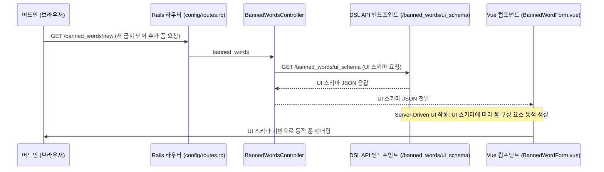
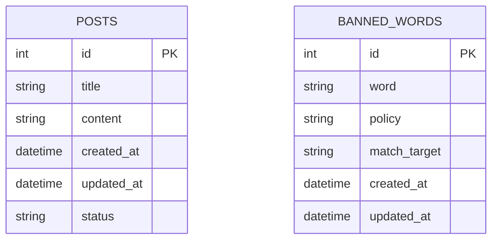

# Ruby on Rails Practice for Admin 

- [✨ 개요](#-개요)
- [🎯 목표](#-목표)
- [📄 요구사항](#-요구사항)
- [💌 API 명세서](#-api-명세서)
- [🏗️ ERD 다이어그램](#%EF%B8%8F-erd-다이어그램)
- [💡기술 스택](#-기술-스택)


## ✨ 개요

이 프로젝트는 Server-Driven-Ui를 통한 어드민 기능을 연습하기 위한 토이 프로젝트입니다. 

**Server-Driven UI** 방식으로 동적 화면 구성을 구현하며, 관리자가 금지 단어를 설정하고, 게시글 작성 시 해당 단어가 포함되지 않도록 하는 기능을 제공합니다.

## 🎯 목표

- Server-Driven UI 방식을 통해 유연하고 유지보수가 쉬운 관리 페이지를 구축합니다.
- 금지 단어 필터링 기능을 구현하여 금지된 단어가 포함된 게시글이 게시되지 않도록 합니다.
    - 필터링 결과를 쉽게 확인하기 위해 현재 화면에 표시하고 있습니다.
- Rails와 Vue.js를 활용하여 전체적인 백엔드와 프론트엔드 기능을 구축합니다.

---

## 📄 요구사항

### 어드민 페이지 요구사항 (금지 단어 관리)

1.1 **금지 단어 관리 기능**

- 어드민은 금지 단어 목록에 단어를 추가, 수정, 삭제할 수 있어야 합니다.
- 금지 단어 항목은 아래의 필드로 구성되며, 각 필드는 특정 정책을 가질 수 있습니다.
    - **단어**: 금지할 단어 또는 표현.
    - **정책**: 해당 단어에 대한 처리 정책 (`ban` 또는 `warn`).
    - **매칭 대상**: 게시물의 특정 부분을 검사할지 설정 (`title_only`, `content_only`, `both`).

1.2 **Server-Driven UI 설정** 

- Rails는 API를 통해 어드민 UI를 정의하기 위한 JSON DSL을 제공합니다.
- 이 DSL은 어드민 페이지에서 사용할 입력 폼을 동적으로 생성하는 데 사용되며, UI 구성 요소의 필드 타입과 필수 여부를 지정할 수 있습니다.
- JSON DSL 예시:
    
    ```json
    {
      "fields": [
        {
          "label": "금지 단어",
          "type": "text",
          "name": "word",
          "required": true},
        {
          "label": "정책",
          "type": "select",
          "name": "policy",
          "options": ["ban", "warn"],
          "required": true},
        {
          "label": "매칭 대상",
          "type": "select",
          "name": "match_target",
          "options": ["title_only", "content_only", "both"],
          "required": true}
      ]
    }
    
    ```
    

1.3 **Vue.js 프론트엔드에서 UI 동적 렌더링**

- Vue.js는 Rails 서버에서 제공하는 JSON DSL을 사용해 어드민 UI를 동적으로 생성합니다.
- JSON 데이터 내 `type` 필드에 따라 적절한 입력 요소를 생성하며, `required` 여부에 따라 필수 입력 필드를 지정합니다.



### 게시물 작성 페이지 요구사항 (사용자용 페이지)

2.1 **게시물 작성 기능**

- 사용자는 제목과 내용을 입력하여 게시물을 작성할 수 있습니다.
- 게시물 저장 요청이 들어오면 서버에서 금지 단어 검사를 수행하여 금지된 단어가 포함되었는지 확인합니다.

2.2 **금지 단어 검사 로직**

- 금지 단어 목록은 데이터베이스에 저장되어 있으며, Rails 서버에서 이를 조회하여 게시물의 제목과 내용을 검사합니다.
- 각 금지 단어 항목의 정책에 따라 금지된 단어가 포함된 경우 게시물의 상태를 변경합니다.
    - **ban 정책**: 해당 단어가 포함된 경우, 게시물의 상태를 `banned`로 설정
    - **warn 정책**: 해당 단어가 포함된 경우, 게시물의 상태를 `warning`으로 설정

### 

## 💌 API 명세서

| HTTP Method | Endpoint | 설명 |
| --- | --- | --- |
| GET | `/posts` | 모든 게시물 목록 조회 |
| GET | `/posts/:id` | 특정 게시물 조회 |
| GET | `/posts/new` | 새 게시물 작성 페이지 |
| GET | `/posts/:id/edit` | 특정 게시물 편집 페이지 |
| POST | `/posts` | 새 게시물 생성 |
| PATCH/PUT | `/posts/:id` | 특정 게시물 수정 |
| DELETE | `/posts/:id` | 특정 게시물 삭제 |
| GET | `/banned-words` | 모든 금지 단어 목록 조회 |
| GET | `/banned-words/:id` | 특정 금지 단어 조회 |
| GET | `/banned-words/new` | 새 금지 단어 작성 페이지 |
| GET | `/banned-words/:id/edit` | 특정 금지 단어 편집 페이지 |
| POST | `/banned-words` | 새 금지 단어 추가 |
| PATCH/PUT | `/banned-words/:id` | 특정 금지 단어 수정 |
| DELETE | `/banned-words/:id` | 특정 금지 단어 삭제 |
| GET | `/banned-words/ui-schema` | Server-Driven UI DSL 제공 |

---

## 🏗️ ERD 다이어그램



---

## 💡 기술 스택

- **Backend**: Ruby on Rails
- **Frontend**: Vue.js
- **Database**: SQLite
- **서버-클라이언트 통신**: Axios를 통한 API 호출
